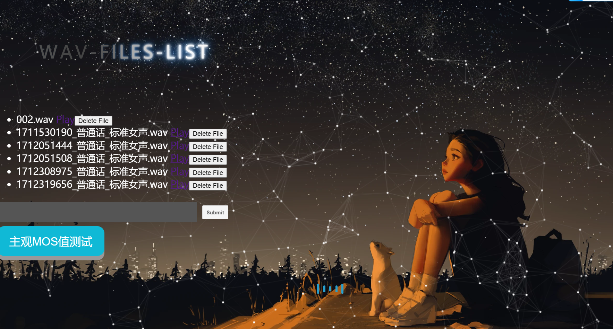

# Flask部署语音合成模型


<p align="center">
  <a href="https://github.com/shaojintian/Best_README_template/">
    
  </a>

  <h3 align="center">项目指南</h3>
  <p align="center">
    快速开始你的项目
    <br />
    <br />
    <br />
    <a href="">查看Demo</a>
  </p>

</p>


 本篇README.md面向开发者
 
## 目录


  - [开发前的配置要求](#开发前的配置要求)
  - [安装步骤](#安装步骤)
- [文件目录说明](#文件目录说明)
- [开发的架构](#开发的架构)
- [部署预览](#部署)
- [使用到的框架](#使用到的框架)
  - [如何参与开源项目](#如何参与开源项目)
- [版本控制](#版本控制)
- [作者](#作者)
- [鸣谢](#鸣谢)


###### 开发前的配置要求

1. Anaconda 3

2. Python 3.8

3. Pytorch 1.13.1

4. Windows 10 or Ubuntu 18.04

###### **安装步骤**
```sh
conda install pytorch==1.13.1 torchvision==0.14.1 torchaudio==0.13.1 pytorch-cuda=11.6 -c pytorch -c nvidia
python -m pip install mvits -U -i https://pypi.tuna.tsinghua.edu.cn/simple
cd VITS-Pytorch
pip install -r requirements.txt
```
```sh
git clone https://github.com/36wolf/flask_and_mysql.git
```
#### 可以在百度网盘上下载完整项目，再执行上述步骤，下完压缩包后不需要再git clone这个部分文件


### 文件目录说明
eg:

```
filelist
📁 .git
📄 .gitattributes
📄 .gitignore
📄 000001.wav
📁 build
📁 configs
📄 create_list.py
📄 daitong.png
📁 dataset
📁 docs
📄 filtered_audio_Kalman.wav
📁 huifuxunlian
📄 infer.py
📄 kaerman.png
📄 kaerman_two.png
📄 LICENSE
📁 log
📁 log_past
📄 mcd_origin.png
📄 mcd_update.png
📄 mel_spectrogram.png
📁 models
📁 mvits
📁 mvits.egg-info
📄 noisy_000001.wav
📁 output
📄 output_bandpass_filtered.wav
📄 preprocess_data.py
📄 README.md
📄 requirements.txt
📁 rizhi
📄 setup.py
📄 third.txt
📄 train.py
📄 VITS-Pytorch.rar
📄 VITS-Pytorch.zip
📁 vits_train
📄 whisper_use.py
📁 __pycache__
📄 傅里叶变换图.py
📄 制表.py
📄 加噪声.py
📄 加速gpu.py
📄 卡尔曼降噪算法.py
📄 数据可视化.py
📄 数据库.py
📄 数据库传值mcd.py
📄 日志可视化.py
📄 自适应学习率.py
📄 面板.py
📄 黑白.py

```


### 部署预览


### 使用到的框架

- [Flask](https://flask.palletsprojects.com/en/3.0.x/)
- [JavaScript](https://jquery.com)
- [MySQL](https://www.mysql.com/)


#### 如何参与开源项目

贡献使开源社区成为一个学习、激励和创造的绝佳场所。你所作的任何贡献都是**非常感谢**的。


1. Fork the Project
2. Create your Feature Branch (`git checkout -b feature/AmazingFeature`)
3. Commit your Changes (`git commit -m 'Add some AmazingFeature'`)
4. Push to the Branch (`git push flask_and_mysql feature/AmazingFeature`)
5. Open a Pull Request


### 版本控制

该项目使用Git进行版本管理。

### 作者

YCL

知乎:https://www.zhihu.com/people/yi-xie-zhi-qiu-12-3-85  &ensp; qq:2957542896   


### 鸣谢

<!-- links -->
[your-project-path]:shaojintian/Best_README_template
[contributors-shield]: https://img.shields.io/github/contributors/shaojintian/Best_README_template.svg?style=flat-square
[contributors-url]: https://github.com/shaojintian/Best_README_template/graphs/contributors
[forks-shield]: https://img.shields.io/github/forks/shaojintian/Best_README_template.svg?style=flat-square
[forks-url]: https://github.com/shaojintian/Best_README_template/network/members
[stars-shield]: https://img.shields.io/github/stars/shaojintian/Best_README_template.svg?style=flat-square
[stars-url]: https://github.com/shaojintian/Best_README_template/stargazers
[issues-shield]: https://img.shields.io/github/issues/shaojintian/Best_README_template.svg?style=flat-square
[issues-url]: https://img.shields.io/github/issues/shaojintian/Best_README_template.svg
[license-shield]: https://img.shields.io/github/license/shaojintian/Best_README_template.svg?style=flat-square
[license-url]: https://github.com/shaojintian/Best_README_template/blob/master/LICENSE.txt
[linkedin-shield]: https://img.shields.io/badge/-LinkedIn-black.svg?style=flat-square&logo=linkedin&colorB=555
[linkedin-url]: https://linkedin.com/in/shaojintian
